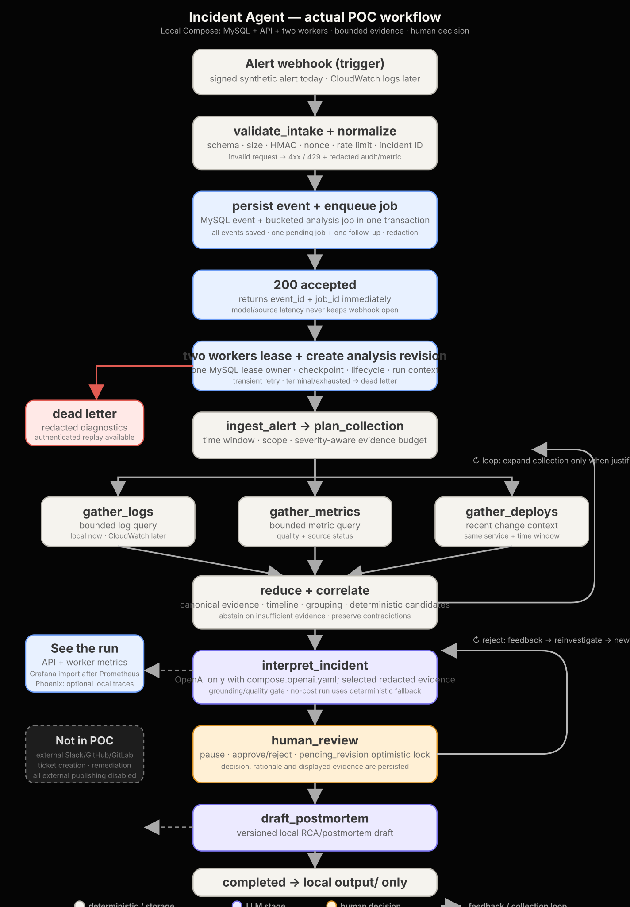

# Incident Agent

Incident Agent turns one signed alert into a small, reviewable incident
analysis. It saves the alert, collects a bounded set of evidence, asks the
model for an evidence-backed explanation, and shows the result to a human.
It never restarts systems, sends tickets, or publishes anything by itself.

### What value it gives

Instead of reading thousands of log lines, an incident responder gets:

- the important events around the alert;
- ranked explanations with the evidence for and against each one;
- an explicit “I do not know” when the evidence is insufficient; and
- a local review page and postmortem draft that a person must approve.

The local stack runs MySQL, an API, and two workers. MySQL keeps the incoming
events, queued jobs, analysis revisions and review decisions, so a worker crash
does not lose or duplicate the analysis.

## Run it

Prerequisites: Docker Engine/Desktop with Compose v2, 4 GB available memory and
host ports `8000`, `3307`, `9101` and `9102` free.

### Complete local run, including OpenAI

Put `OPENAI_API_KEY`, `OPENAI_BASE_URL` and `OPENAI_MODEL` in the ignored
`.env` file. This is the normal command when you want to see the whole flow,
including the model:

```bash
docker compose -f compose.yaml -f compose.openai.yaml up --build --wait
docker compose -f compose.yaml -f compose.openai.yaml --profile tools run --rm --no-deps verify
```

Then open:

- review UI: `http://127.0.0.1:8000/`
- API contract: `http://127.0.0.1:8000/docs`
- readiness: `http://127.0.0.1:8000/readyz`
- API metrics: `http://127.0.0.1:8000/metrics`
- worker metrics: `http://127.0.0.1:9101/metrics` and `:9102/metrics`

Local review credentials are `incident-reviewer` / `local-review-only`. They
are deliberately non-secret and must never be reused outside local Compose.

The OpenAI run sends only the synthetic alert's redacted evidence to the
provider. `PUBLISH_EXTERNAL=false` still prevents publishing or remediation.

### No-cost topology check

Use this for CI, recovery drills, or when you only want to verify API → queue
→ two workers → review without a provider call:

```bash
docker compose up --build --wait
docker compose --profile tools run --rm --no-deps verify
```

Here `MODEL_ENABLED=false` and `SKIP_LLM=true` are intentional. The pipeline
still runs end-to-end, but its interpretation is deterministic. Setting only
`SKIP_LLM=false` would not activate OpenAI because `MODEL_ENABLED=false` also
disables it; `compose.openai.yaml` switches both settings and permits egress.

The complete preflight, expected output, failure drills and reset procedure are
in the [`Docker Compose runbook`](docs/operations/LOCAL_DOCKER_COMPOSE.md).

## What starts locally

```text
signed synthetic alert
        |
        v
 API :8000  ---> MySQL :3306 (host inspection :3307)
        |          | durable event + queue transaction
        |          | revisions + checkpoints + review state
        |          |
        |       +--+----------------+
        |       |                   |
        |   worker-1 :9100      worker-2 :9100
        |       |                   |
        +-------+----- LangGraph ---+
                        |
                 human review UI
                        |
                 local HTML draft
                 external publish OFF
```

The `migrator` service runs first under a DDL-capable identity and exits. API
and worker users only receive data-plane grants. The API becomes ready only
after the current migration exists, MySQL and the queue respond, and at least
two current worker heartbeats are visible.



## What a run produces

The review UI is the main result. Send the canary above, then open
`http://127.0.0.1:8000/` and select the incident. It contains the evidence,
candidate explanations, uncertainty and the review decision.

| Where | What it tells you | How to open it |
| --- | --- | --- |
| Review UI | The human-facing analysis and local postmortem draft | `http://127.0.0.1:8000/` |
| API and worker metrics | Queue, workers, errors, model budgets and latency | `:8000/metrics`, `:9101/metrics`, `:9102/metrics` |
| MySQL | Durable events, jobs, revisions and review decisions | `127.0.0.1:3307` for local inspection |
| `/app/output` volume | Generated HTML drafts and bounded local raw-log cache | `docker compose exec api ls -lah /app/output` |

`config/incident_agent_dashboard.json` is a **Grafana import file**, not a
running dashboard. Import it into Grafana after Prometheus is configured to
scrape the three metrics endpoints. It shows workers, queue state, dead
letters, MySQL-pool use, rejected alerts and the publication guard.

Phoenix is optional local trace viewing: it shows the timing and route through
LangGraph and the model call. It is not started by Compose and it is not needed
to run an incident. Start it only for native debugging with
`.venv/bin/python scripts/start_phoenix.py`; its local data stays in the
ignored `.phoenix_data/` folder. The trace UI is `http://127.0.0.1:6006/`.

## Why the system exists

Operational alerts are noisy, incomplete and frequently misleading. This
system converts them into a reviewable evidence trail without allowing an LLM
or an untrusted webhook to become an autonomous operator. Its design goals are:

- preserve every accepted event and its provenance;
- acknowledge only after event and work are durably committed together;
- bound source queries, model calls, token use, cost and incident scope;
- distinguish observations, hypotheses, contradictions and unknowns;
- make human decisions explicit, version-bound and auditable;
- recover work after process loss without duplicating durable analysis effects;
- default to abstention and local drafts when evidence or dependencies fail;
- prohibit automatic remediation.

## Incident-response skills and real use cases

The portable skills in [`skills/`](skills/README.md) give the agent and its
operators a consistent incident-response playbook. They complement the
durable workflow; they do not override its approval gates or allow automatic
remediation.

| Skill | Why it fits this project | Concrete use case |
| --- | --- | --- |
| [`agent-incident-responder`](skills/agent-incident-responder/SKILL.md) | Matches the system's human-in-the-loop, evidence-first and abstention-by-default design. | When the graph turns collected Loki, Prometheus and GitHub evidence into ranked, confidence-scored hypotheses for review. |
| [`severity-classification`](skills/severity-classification/SKILL.md) | Ensures that incident impact is assessed consistently before escalation and review. | A broad customer-facing outage is classified as SEV-1/2 and routed to the full review process with the right urgency. |
| [`alerting-principles`](skills/alerting-principles/SKILL.md) | Helps keep incoming alerts actionable and bounded, which improves evidence collection and reduces noise. | Reviewing a noisy alert rule to add affected service, customer impact, dashboard link and a clear next action. |
| [`incident-runbook`](skills/incident-runbook/SKILL.md) | Connects the technical analysis with the people coordinating a live incident. | The reviewer uses the generated evidence trail to hand off status, assign roles and decide whether more evidence is needed. |
| [`postmortem-writer`](skills/postmortem-writer/SKILL.md) | Fits the versioned postmortem-draft stage and its separate publication approval. | Turning an approved RCA, timeline and unknowns into a blameless draft that a human approves before publication. |
| [`security-incident`](skills/security-incident/SKILL.md) | Adds a dedicated process when the evidence points to a possible security event. | A suspected credential leak or unauthorized access signal triggers containment and security-specific review rather than ordinary RCA only. |
| [`anti-patterns`](skills/anti-patterns/SKILL.md) | Provides a process check against common failure modes in incident handling. | Reviewing a proposed response that skips ownership, hides uncertainty or treats an unverified hypothesis as fact. |


## End-to-end lifecycle

1. **Authenticate and constrain intake.** The API bounds request size and
   batch width, validates JSON and the alert contract, enforces caller/global
   rate limits, checks HMAC authentication and rejects tenant mismatches.
   Shadow/production signatures include timestamp and nonce replay protection.

2. **Normalize and redact.** Alertmanager/Grafana-shaped alerts and supported
   CloudWatch EventBridge events become a canonical incident alert. Untrusted
   fields are size-bounded and secrets/PII are redacted before durable state,
   prompts, logs and reports.

3. **Commit event and job atomically.** MySQL stores the incident event,
   idempotency digest and queue row in one transaction. An identical delivery
   returns `duplicate_event`; it does not create another job.

4. **Lease work.** Independent workers use transactional claims, renewable
   leases, worker heartbeats and an incident lock. A crashed worker's expired
   lease can be reclaimed. Retry exhaustion creates a dead letter instead of
   silently dropping work.

5. **Run the checkpointed graph.** LangGraph state is stored directly in MySQL
   with immutable checkpoint/write conflict checks, so another process can
   continue the same thread. The graph plans collection, gathers bounded logs,
   metrics and deployment evidence, normalizes data, extracts features,
   correlates signals and scores hypotheses.

6. **Interpret cautiously.** Deterministic correlation remains primary.
   Optional semantic/model stages receive bounded, redacted context and are
   charged against per-incident call, token, cost and deadline budgets. Source
   or model failure can produce an explicit abstention rather than invented
   evidence.

7. **Pause for analysis review.** The reviewer sees evidence, contradictions,
   ranked hypotheses and uncertainty. Approve, reject or request more evidence
   is tied to the current pending revision; stale browser decisions fail.

8. **Create a postmortem draft.** Approval continues RCA and drafting. Drafts
   are versioned and local by default.

9. **Pause for publication review.** A second decision is bound to the exact
   draft version and SHA-256 digest. The first review never implicitly approves
   external publication.

10. **Guard any external effect.** Before a publisher call, MySQL records a
    unique publication attempt. Completed attempts deduplicate. If provider
    acknowledgement is uncertain after a crash, automatic retry is blocked for
    operator reconciliation.

The full graph is available as [`SYSTEM_FLOW.svg`](docs/architecture/SYSTEM_FLOW.svg),
and record-level invariants are in
[`CANONICAL_SCHEMAS.md`](docs/architecture/CANONICAL_SCHEMAS.md).

## Delivery and consistency semantics

| Boundary | Guarantee |
| --- | --- |
| Webhook redelivery | Content-based idempotency; identical accepted event is not re-enqueued |
| Event to queue | Event row and job row commit atomically |
| Queue execution | At-least-once after lease expiry/reclaim |
| Analysis revision | Job-id idempotency prevents duplicate durable revision effects |
| Checkpoint write | Database-direct, multi-process-safe keys with immutable conflict checks |
| Human decision | Bound to the current pending revision and reviewer identity |
| Publication approval | Bound to exact draft version and SHA-256 |
| Aggregate publication | Durable at-most-once attempt guard; uncertainty blocks automatic retry |

### High-volume incident bucketing

Matching alerts share a 5-minute bucket. All events are saved, but each bucket
keeps one pending analysis job and at most one follow-up while it runs.

**100,000-event result (two workers + OpenAI):** 12 analysis jobs, 12
successful OpenAI calls, 0 dead letters. After the 12-call incident budget is
reached, later revisions use the deterministic fallback.

The default Compose load test makes no external calls. Use
`compose.openai.yaml` when the synthetic load is intended to exercise OpenAI.


## Main components

| Path | Responsibility |
| --- | --- |
| `webhook/` | FastAPI routes, auth, intake, durable incident store, queue, lifecycle and worker runtime |
| `graph/` | LangGraph state, workflow, nodes, routing and MySQL checkpointer |
| `clients/` | Loki, Prometheus, CloudWatch, GitHub, Slack and model adapters |
| `utils/` | Redaction, evidence, correlation, budgets, audit, MySQL pooling and observability |
| `prompts/` | Versioned interpretation, semantic correlation, RCA and postmortem prompts |
| `rules/` | Deterministic detection rules with safe checks |
| `config/` | Service catalog, source schemas, suppressions, dashboards, alerts and environment examples |
| `evaluation/` | Public/synthetic dataset loaders, scoring and reports |
| `fixtures/` | Safe local alert and benchmark fixtures |
| `scripts/` | Entrypoints, migrations, quality gates, evaluations and recovery drills |
| `tests/` | Unit, contract, security, integration, MySQL and multi-process tests |
| `docker/` | Local database bootstrap used by Compose |
| `docs/` | Architecture, contracts, operations, development decisions and historical reports |

The code deliberately remains in explicit top-level Python packages. Moving it
under `src/` would not improve runtime isolation and would create unnecessary
import/deployment churn; documentation and operational artifacts are grouped
instead of mixed into root.

## Repository root

Only high-signal entrypoints and deployment files live at root:

- `README.md` — this overview;
- `compose.yaml` and `Dockerfile` — local topology and immutable runtime image;
- `app.py`, `settings.py`, `langgraph.json` — application entry/configuration;
- `pyproject.toml` and `requirements*.{txt,in,lock}` — tooling and locked dependencies;
- `.env.example` — native local configuration reference.

Generated reports, local databases, caches, `.env` and runtime state are
ignored by Git.

Compose mounts `/app/output` as the only persistent writable application path.
It contains generated HTML and the bounded local SQLite raw-log cache needed by
cross-process graph continuation. Durable events, canonical evidence, queue,
reviews and checkpoints remain in MySQL. Production retention/object-storage
policy for raw source data is an explicit deployment decision.

## Docker Compose operation

### Start and verify

```bash
docker compose config --quiet
docker compose up --build --wait
docker compose --profile tools run --rm --no-deps verify
docker compose ps
```

The E2E verifier requires two workers, sends a signed synthetic alert, retries
the same body, proves deduplication, waits for completion and verifies a durable
analysis revision.

### One-command local stress test

Run this only against the disposable local Compose environment. It stops any
running local API/workers first (named volumes are preserved), then starts only
MySQL, the migrator and an isolated stress runner:

```bash
docker compose down && docker compose --profile tools run --build --rm stress
```

The runner executes 20 cycles of 200 jobs with eight independent child workers
(**4,020 jobs** in total). Every cycle verifies a cross-process MySQL
checkpoint, force-kills one worker with `SIGKILL` after its durable effect,
checks that the job is reclaimed exactly once, and confirms one durable revision
per job. It refuses to mix with an active queue, cleans up its own probe rows,
uses no hosted model or external connector, and cannot publish externally.

Afterwards, restart the normal local topology when needed:

```bash
docker compose up --build --wait
```

### Follow logs

```bash
docker compose logs --follow --tail=200 api worker-1 worker-2 mysql
```

### Preserve or erase state

```bash
docker compose down
```

The command above preserves named volumes. This permanently erases local
Compose state and should only be used for disposable data:

```bash
docker compose down --volumes
```

See the [`local runbook`](docs/operations/LOCAL_DOCKER_COMPOSE.md) before
performing kill/recovery tests.

## Native local development

Docker Compose is the preferred shareable path. For debugger access or focused
tests, use Python 3.11 and MySQL 8.4 directly:

```bash
python3.11 -m venv .venv
.venv/bin/python -m pip install --upgrade pip==26.2.1 setuptools==84.0.0
.venv/bin/python -m pip install --require-hashes -r requirements.lock
cp .env.example .env
```

Phoenix is optional and intentionally excluded from the server image because a
transitive package is not published for every Linux target. To use
`scripts/start_phoenix.py` on a supported developer workstation, install its
extra dependencies separately:

```bash
.venv/bin/python -m pip install -r requirements-observability.txt
```

Create the configured MySQL database, then apply migrations under the migrator
role:

```bash
PROCESS_ROLE=migrator RUNTIME_SCHEMA_DDL_ENABLED=false \
  .venv/bin/python scripts/migrate_database.py apply
```

Start the same separated topology without Docker:

```bash
.venv/bin/python scripts/start_local_cluster.py --workers 2
```

Or start components in separate terminals with
`scripts/start_api.py` and `scripts/run_worker.py`. When workers are separate,
set `API_DRAIN_JOBS=false` for every process. More details are in
[`SETUP_GUIDE.md`](docs/operations/SETUP_GUIDE.md).

## HTTP surface

The running service publishes its exact OpenAPI schema at `/openapi.json` and
interactive docs at `/docs`. Important routes are:

| Method and path | Purpose |
| --- | --- |
| `POST /v1/alerts` | Signed alert intake; `/alerts` is a compatibility alias |
| `GET /` | Pending-review dashboard |
| `GET /incidents/{thread_id}` | Current review screen |
| `POST /alerts/{thread_id}/review` | Analysis decision or request for more evidence |
| `POST /alerts/{thread_id}/publish` | Exact-draft publication decision |
| `POST /v1/incidents/{thread_id}/reprocess` | Enqueue a new analysis run |
| `POST /v1/dead-letters/{job_id}/replay` | Controlled dead-letter replay |
| `GET /alerts/{thread_id}/review/status` | Pending review status |
| `GET /v1/canary/jobs/{job_id}` | Authenticated synthetic-canary status |
| `GET /healthz` | Process liveness only |
| `GET /readyz` | Runtime configuration, DB, queue and worker readiness |
| `GET /metrics` | Prometheus-format API/runtime metrics |

Do not treat `/healthz` as permission to route traffic. `/readyz` is the
deployment gate.

## Configuration model

Configuration is loaded from environment variables through `settings.py`.
`.env.example` documents the complete native-local surface; secure environment
baselines are in `config/shadow.env.example`.

Important groups:

| Group | Key examples | Safety rule |
| --- | --- | --- |
| Runtime | `ENVIRONMENT`, `PROCESS_ROLE`, `SERVICE_VERSION` | Secure modes fail closed on unsupported combinations |
| Database | `MYSQL_*`, `CHECKPOINTER`, `RUNTIME_SCHEMA_DDL_ENABLED` | API/worker roles have no DDL; migrator is separate |
| Queue | `JOB_LEASE_SECONDS`, `MIN_ACTIVE_WORKERS`, `MAX_PENDING_JOBS`, `INCIDENT_BUCKET_SECONDS`, `INCIDENT_COALESCE_SECONDS`, `INCIDENT_COALESCE_MAX_SECONDS` | Heartbeat, lease, bucket and debounce timings are validated |
| Intake | HMAC/replay settings, source/proxy CIDRs, body and rate limits | Reject before analysis when contract fails |
| Sources | `LOG_SOURCE`, `METRIC_SOURCE`, connector URLs and severity-aware query limits | Source selection comes from deployment config, never alert fields |
| Model | provider/model, retry, deadline, token and cost limits | Secure modes forbid missing hosted credentials or `SKIP_LLM=true` |
| Review | basic local values or `OIDC_*`, CSRF/session secrets and role sets | Shadow/production require OIDC and explicit roles |
| Publishing | `PUBLISH_EXTERNAL` | Default false; approval and durable attempt guard still required |
| Observability | OTLP/Phoenix, metrics token, version labels | Prompt/state content is hidden by default in traces |

`ENVIRONMENT=shadow` and `production` invoke strict startup validation for
managed secrets, HTTPS URLs, OIDC, TLS-verified MySQL, tenant isolation,
explicit CORS/egress, current migrations, dedicated roles and worker topology.

The header format, source-address handling and rate-limit order are specified
in [`WEBHOOK_INGRESS.md`](docs/operations/WEBHOOK_INGRESS.md).

## Security boundaries

All of the following are treated as untrusted: webhook payloads, connector
responses, model output, reviewer feedback and future publisher responses.
Controls include:

- HMAC authentication, timestamp/nonce replay defense and constant-time checks;
- body, batch, field, query, retry, token, cost and queue limits;
- service/environment/tenant allowlists;
- recursive secret and PII redaction before persistence or model use;
- output escaping and explicit untrusted-data wrappers;
- deployment-owned connector selection and egress allowlists;
- separate local/basic and secure/OIDC review modes with CSRF/session controls;
- append-only events, audit records and version-bound decisions;
- non-root, read-only application containers;
- external publication off by default and no automatic remediation.

The threat model and remaining environment controls are documented in
[`SECURITY_AND_OPERATIONS.md`](docs/operations/SECURITY_AND_OPERATIONS.md).

## MySQL, migrations and recovery

MySQL is the system of record for accepted events, queue state, incident and
analysis revisions, canonical evidence, reviews, postmortem drafts, lifecycle,
dead letters, worker heartbeats, publication attempts, audit records and
LangGraph checkpoints.

Current migrations are versioned in `scripts/migrate_database.py`. They execute
under a named advisory lock and record completion in `schema_migrations`:

```bash
PROCESS_ROLE=migrator RUNTIME_SCHEMA_DDL_ENABLED=false \
  python scripts/migrate_database.py apply
PROCESS_ROLE=migrator RUNTIME_SCHEMA_DDL_ENABLED=false \
  python scripts/migrate_database.py check
```

Runtime schema creation must remain disabled for API and workers. Additive
migrations support code-first rollback: stop intake, restore the previous
application version, leave compatible columns in place and verify readiness.
Destructive schema rollback requires a tested restore point.

Recovery tools include:

```bash
python scripts/verify_distributed_runtime.py --jobs 64 --workers 4
python scripts/run_resilience_soak.py --cycles 5 --jobs-per-cycle 50 --workers 4
python scripts/check_pitr_readiness.py --minimum-retention-seconds 86400
python scripts/verify_backup_restore.py
```

The backup verifier restores into a new isolated database and checks both an
incident event and a checkpoint. It never overwrites the source database. See
[`OPERATOR_RUNBOOKS.md`](docs/operations/OPERATOR_RUNBOOKS.md).

## Observability and operations

The API and workers emit structured events and Prometheus-format metrics for
intake outcomes, queue depth, active/stale workers, lease/retry/dead-letter
state, MySQL pool use, connector/model failures, latency, budgets and
publication status. Version labels connect evidence to the application,
analysis-code and prompt releases.

Repository artifacts include:

- `config/incident_agent_dashboard.json` — dashboard baseline;
- `config/incident_agent_alerts.yml` — alert rules;
- `config/recording_rules.example.yml` — derived metric examples;
- `scripts/production_preflight.py` — combined secure-config/schema/PITR/HA gate;
- `docs/operations/RELEASE_EVIDENCE.md` — immutable release evidence template.

## Tests and quality gate

Install development tools from the locked requirements, then run:

```bash
.venv/bin/python scripts/quality_gate.py
```

The gate performs:

- value-suppressing repository secret scanning;
- local Markdown link validation;
- Compose topology/safety validation;
- Ruff, scoped mypy and Python compilation;
- prompt-budget checks;
- the complete MySQL-backed test suite with branch coverage;
- whole-repository, core-path and security-path coverage thresholds.

CI additionally runs four-worker process/SIGKILL tests, repeated resilience
soak, isolated backup/restore, deploy artifact validation, dependency audit,
SBOM generation, scheduled dependency-security evidence and a real Compose
build/start/two-worker E2E canary. GitHub-hosted Code Scanning is deliberately
not used while this private repository does not have GitHub Advanced Security.

Focused commands:

```bash
.venv/bin/ruff check .
.venv/bin/python -m unittest discover -s tests
.venv/bin/python scripts/check_markdown_links.py
.venv/bin/python scripts/validate_compose_config.py
.venv/bin/python scripts/validate_deploy_artifacts.py
```

## How the analysis system was developed and evaluated

This repository does **not** train or fine-tune a foundation model. It combines
deterministic incident-analysis code with an optional, bounded model call. The
development loop improves contracts, normalization, evidence handling and
prompts; it does not change model weights. A benchmark result below is evidence
for a specific system boundary, not a claim that an LLM was trained on incident
data.

### Where each part lives

| Area | Folder(s) | Development and verification role |
| --- | --- | --- |
| System graph | `graph/`, `graph/nodes/`, `graph/state.py` | The checkpointed LangGraph flow: collection, normalization, correlation, interpretation, review and drafting. State and routing are tested independently and across process boundaries. |
| Durable runtime | `webhook/`, `utils/mysql.py`, `graph/checkpointer.py` | MySQL event store, queue leases, revisions, review state and checkpoints. Tests cover multiple workers, transient deadlocks, process loss, recovery and backup/restore. |
| Evidence and safety | `utils/`, `rules/`, `clients/` | Redaction, normalization, fingerprints, deterministic signals, bounded source adapters, grounding, budgets and output safety. |
| Model boundary | `prompts/`, `utils/observability.py`, `clients/openai_client.py` | Versioned prompts and structured-output boundary. The model receives bounded redacted evidence and may abstain; it cannot publish or remediate. |
| Scenarios and facit | `fixtures/`, `evaluation/`, `data/` | Synthetic contract scenarios and public-log adapters. Labels/fault metadata are held out until after deterministic processing and model output. |
| Regression evidence | `tests/`, `scripts/`, `output/`, `docs/reports/` | Tests, repeatable scorecards, ignored generated JSON/HTML artifacts and reviewed dated reports. |

Raw external logs and generated evaluation outputs are local operational data:
they live under `data/` and ignored `output/`. Provenance, commands, thresholds
and reviewed summaries live in `docs/reports/`. Ground truth is never inserted
into alerts, candidate scoring, prompts or model requests; it is joined by the
evaluator only after the result is frozen.

### Development loop

```text
safe fixture/public raw logs
        -> normalize + redact + infer groups
        -> deterministic evidence and impact contracts
        -> bounded, optional model interpretation
        -> human-review artifact
        -> join held-out labels and score
        -> add a regression test or improve a general contract
```

The loop is intentionally conservative. A dataset-specific label is never
turned into a hidden rule merely to raise a score. When evidence does not
establish impact or causality, the expected safe result is an abstention.

### Current verified signals

Each value below has a narrow meaning; they must not be combined into one
fictional “model accuracy” number.

| Boundary | Current result | What it establishes |
| --- | --- | --- |
| Engineering quality gate | **349 tests**; **75.4%** whole-repository, **82.2%** core-path and **95.9%** security-path branch coverage | Code/regression coverage and local runtime behavior, not incident accuracy. |
| HDFS 2k grouping | **100%** pair precision; **96.60%** recall; 14/14 source templates retained | Over-merging/fragmentation on one public corpus; template IDs are not incident causes. |
| HDFS v3/TraceBench grouping | **100%** pair precision; **98.83%** recall; 75/75 labels retained | Generalization of normalized grouping; TraceBench labels are an upstream proxy. |
| Curated BGL/OpenStack pair gate | **73/73** pairs; 100% precision, recall and specificity | A reviewed normalization contract boundary, not an independent human gold-set. |
| Spark 2k parser/grouping | 2,000/2,000 parsed; **100%** precision; **98.91%** recall; **99.45%** F1 | Parser/grouping quality on an INFO-only sample; not failure detection or RCA. |
| Hadoop typed pre-review | 100% grounding (55/55); 0 unknown evidence IDs; 0 unsupported predictions; 98.18% exact-or-honest-abstention | Label-last evidence/review boundary. Raw exact agreement is 32.73% because many supplied labels are absent from, or conflict with, recoverable evidence. |
| Live model evaluation (2026-08-09) | 22 successful bounded calls; 0 unknown evidence IDs/unsupported percentages | Provider transport, structured output and abstention/grounding on limited cases; not production reliability or causal accuracy. |
| OpenAI bucket load (2026-08-24) | 100,000 synthetic events; 12 revisions, 12 successful provider calls and 0 dead letters | Local admission, coalescing and deterministic budget fallback; not capacity, cost-calibration or production evidence. |

See the full methodology in
[`PRE_REVIEW_EVALUATION.md`](docs/reports/PRE_REVIEW_EVALUATION.md),
and [`OPENAI_LIVE_EVALUATION_2026-08-09.md`](docs/reports/OPENAI_LIVE_EVALUATION_2026-08-09.md).

### Reproducing the evidence

Run the full code-quality gate, then the relevant label-last evaluator:

```bash
.venv/bin/python scripts/quality_gate.py
.venv/bin/python scripts/evaluate_pre_review.py
.venv/bin/python scripts/evaluate_hadoop_typed_review.py --cases 55 \\
  --output output/hadoop-typed-review-all-55.json
```

Before external use, run harmless representative incidents from each real alert
and evidence source, retain operator truth separately, and review abstentions
and contradictions with responders.

## Before connecting a target environment

Code-level multi-process and recovery foundations do not replace these
environment and technical gates. Complete them before opening external
ingress or sending real telemetry to a model.

1. **Platform and network.** Choose the deployment platform, IaC and CI/CD.
   Provision managed MySQL with encrypted storage, verified TLS, separate
   migrator/API/worker identities and backups. Configure HTTPS, DNS, WAF/rate
   limiting and failure-domain worker placement.
2. **Data and security.** Approve which alerts, logs and evidence classes may
   leave the environment or reach the model. Set classification, retention,
   deletion, legal hold, encryption and backup rules; place all credentials in
   an approved secret manager.
3. **Identity and access.** Choose the IdP (for example Entra ID or Okta), map
   reviewer/operator/admin roles, define tenant boundaries and register the
   OIDC application. Validate CORS, CSRF and access audit requirements.
4. **Operating targets.** Ratify SLOs, expected traffic, per-incident model and
   infrastructure cost limits, and RPO/RTO. Alert on queue depth, expired
   leases, dead letters, stale workers, MySQL/PITR, source/model failures and
   budget exhaustion.
5. **OpenAI/provider policy.** Approve model, region, data-retention/training
   terms, egress allowlist, secret-manager delivery and billing reconciliation.
   Keep model cost/token budgets positive and calibrated outside local mode.
6. **Quality and shadow evidence.** Prepare at least 100 representative
   anonymised incidents or approved replays, define scoring thresholds, then run
   a read-only shadow period with no publication.

Then run `scripts/production_preflight.py` and attach the resulting release
evidence. The authoritative checklist is
[`PRODUCTION_READINESS.md`](docs/operations/PRODUCTION_READINESS.md); it is the
source of truth over informal “production ready” claims.

## Documentation map

Start with [`docs/README.md`](docs/README.md). The main sections are:

- `docs/architecture/` — topology, data model, memory and ADRs;
- `docs/contracts/` — input, API, connector, evidence, hypothesis and review contracts;
- `docs/operations/` — Compose, setup, runbooks, security and readiness;
- `docs/development/` — project compass, tests, governance and deferred work;
- `docs/reports/` — dated evaluation and readiness evidence.

Historical reports explain what was proven at a point in time. Current code,
contracts and production-readiness criteria take precedence.

## Safe defaults and explicit non-goals

- No automatic remediation is implemented.
- Local Compose does not call real telemetry, GitHub, Slack or a hosted model.
- External publication is disabled by default.
- Model confidence is ranking evidence, never proof of causality.
- A healthy API process is not the same as a ready incident system.
- Local credentials, unverified MySQL transport and fixture evidence must not be
  promoted into shadow or production.

That boundary is intentional: the agent assists incident responders while
durability, authorization and final decisions remain explicit system controls.
